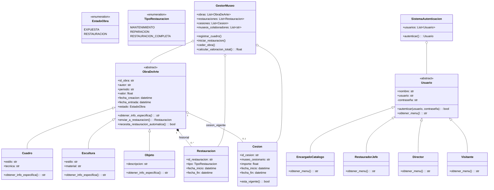

# Sistema de Gestión de Obras de Arte (Museo)

Este es el taller POO sobre la gestion de las obras, cuadro y obras del museo desarrollado en Java utilizando Programación Orientada a Objetos.

## Diagrama UML de Clases

A continuación se presenta la arquitectura del sistema:

